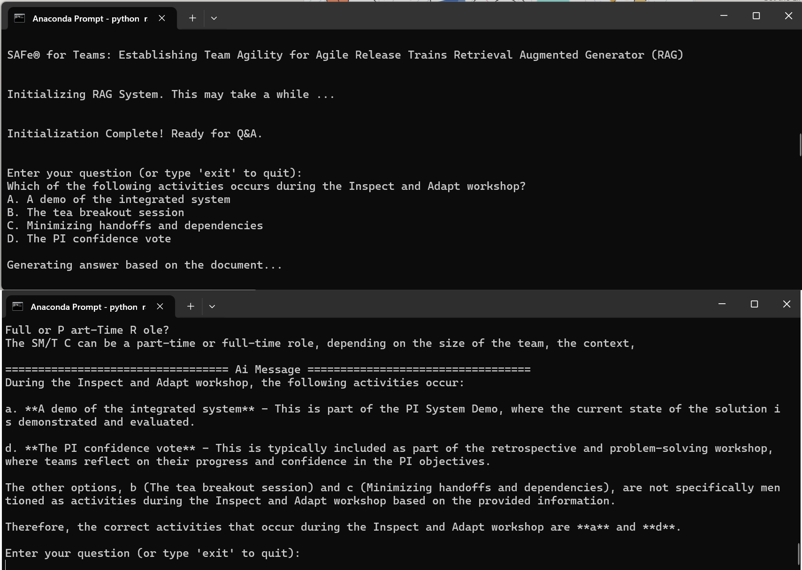

# Retrieval-Augmented Generator (RAG) for SAFe® for Teams Workbook



## Overview

This project demonstrates a **Retrieval-Augmented Generator (RAG)** system designed to answer multiple-choice questions based on the content of an uploaded PDF file. By leveraging state-of-the-art AI techniques, this system allows users to quickly extract and synthesize information from complex documents. 

In this implementation, the example document is the *SAFe® for Teams: Establishing Team Agility for Agile Release Trains 6.0.2* workbook. The system can be accessed via a Command Line Interface (CLI) or through sample notebooks provided in the `notebooks/` folder.

An example output of the system in action is shown in [`assets/rag-sample.png`](assets/rag-sample.png).

This project highlights my expertise in **AI development**, focusing on advanced natural language processing (NLP) techniques and RAG workflows.

---

## Features

- **Efficient PDF Parsing**: Extracts content from PDF files and splits it into manageable chunks for processing.
- **AI-Powered Question Answering**: Leverages OpenAI's GPT-4 and FAISS (a fast vector search library) to answer multiple-choice questions accurately.
- **Streamlined CLI Interface**: Interact with the RAG system directly through a terminal-based command-line interface.
- **Jupyter Notebooks**: Explore and experiment with the system using sample notebooks provided in the `notebooks/` folder.

---

## Technologies Used

- **LangChain**: For document loading, vector store management, and tools integration.
- **FAISS**: For efficient vector-based document retrieval.
- **OpenAI GPT-4**: For natural language understanding and generation.
- **Python**: The backbone of the system, showcasing advanced scripting and modular design.
- **PyPDFLoader**: To extract text from PDF documents.
- **RecursiveCharacterTextSplitter**: To split the document into manageable chunks while preserving context.

---

## Installation

### Prerequisites
- Python 3.8 or later
- An OpenAI API key
- Dependencies listed in `requirements.txt`

### Steps
1. Clone this repository:
   ```bash
   git clone https://github.com/your-username/your-repo-name.git
   cd your-repo-name
   ```

2. Install dependencies:
   ```bash
   pip install -r requirements.txt
   ```

3. Set your OpenAI API key:
   ```bash
   export OPENAI_API_KEY="your-api-key"
   ```

4. Place your PDF document in the `data/` directory (e.g., `data/CERT_RAG.pdf`).

---

## Usage

### CLI Interface
Run the CLI script to interact with the system:
```bash
python rag_cli.py
```

Follow the prompts to input your question and multiple-choice options. For example:
```text
Enter your question (or type 'exit' to quit):
What is the primary purpose of Agile Release Trains?
A. To deliver value to customers
B. To manage team dependencies
C. To ensure compliance with regulations
D. To create detailed project plans
```

The system will process the input and provide an AI-generated answer based on the PDF content.

### Jupyter Notebooks
Explore the project through interactive notebooks located in the `notebooks/` folder. These notebooks demonstrate how to:
- Parse a PDF file
- Build and query the RAG system
- Visualize results

---

## File Structure

```
.
├── data/
│   └── CERT_RAG.pdf              # Example PDF document
├── notebooks/
│   └── example_notebook.ipynb    # Sample notebook for experimentation
├── assets/
│   └── rag-sample.png            # Example output image
├── requirements.txt              # Python dependencies
├── rag_cli.py                    # CLI script for RAG system
├── README.md                     # Project documentation
```

---

## Example Output

Here is a sample output from the system:

```text
Enter your question (or type 'exit' to quit):
What is the primary purpose of Agile Release Trains?
A. To deliver value to customers
B. To manage team dependencies
C. To ensure compliance with regulations
D. To create detailed project plans

Generating answer based on the document...

================================== AI Message ==================================
The primary purpose of Agile Release Trains is: A. To deliver value to customers.
```

---

## Highlights of AI Development Expertise

1. **RAG Workflow Design**: Demonstrated ability to integrate state-of-the-art NLP models with document retrieval systems to create an intelligent, interactive tool.
2. **Vector-Based Search**: Utilized FAISS to efficiently manage and query large document embeddings, enabling precise retrieval of relevant information.
3. **Streamed AI Responses**: Designed a system that streams AI-generated answers dynamically, ensuring a responsive and interactive user experience.
4. **Customizable Tools**: Built a modular, reusable framework for document-based question answering.

---

## Future Enhancements

- Add support for additional document formats (e.g., Word, HTML).
- Extend the CLI to include batch processing for multiple questions.
- Develop a web-based GUI for easier accessibility.
- Enhance support for multilingual documents.

---

## License

This project is licensed under the MIT License. See `LICENSE` for more details.

---

## Contact

For questions or collaboration, feel free to reach out:
- **Email**: rein@yourdomain.com
- **LinkedIn**: [Your LinkedIn Profile](https://www.linkedin.com/in/your-profile)
- **GitHub**: [Your GitHub Profile](https://github.com/your-username)

---
